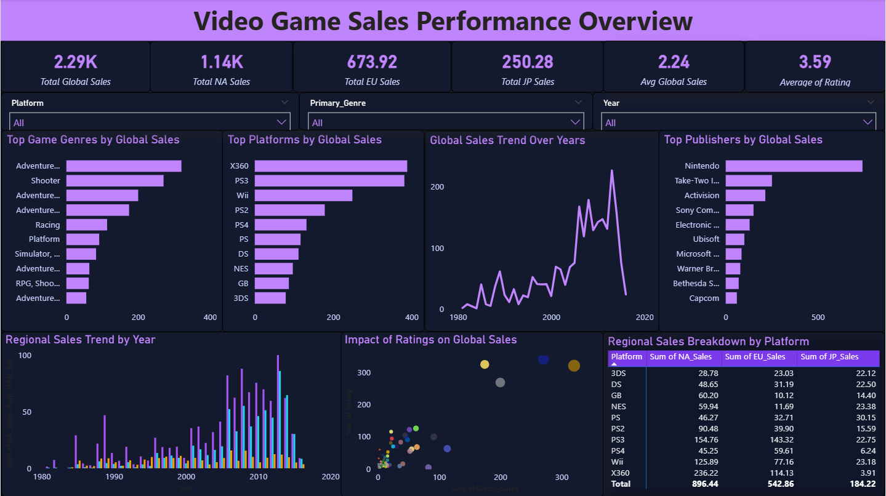

#  Video Game Sales Analysis

##  Project Overview
This is an end-to-end Data Analytics project focused on analyzing global video game sales trends using Python, SQL, and Power BI.

The goal of this project was to clean, analyze, and visualize historical video game sales data to uncover business insights related to genres, platforms, publishers, and regional performance.

---

##  Tools & Technologies Used
- Python (Pandas, Matplotlib, Seaborn)
- SQL (MySQL)
- Power BI
- Jupyter Notebook

---

##  Project Workflow

###  Data Cleaning & EDA (Python)
- Handled missing values
- Removed duplicates
- Standardized column formats
- Performed exploratory data analysis

---

###  Business Analysis (SQL)
Solved real-world business questions like:
- Top selling platforms
- Most profitable game genres
- Regional sales comparison
- Publisher performance analysis

---

###  Interactive Dashboard (Power BI)
Built a professional dashboard to visualize:
- Global sales trends over time
- Top genres and platforms
- Regional sales distribution
- Impact of ratings on sales

---

## Key Insights
- Action and Shooter genres dominate global sales
- North America contributes highest revenue
- PS3 and Xbox 360 are top performing platforms
- Sales peaked between 2005–2012

---

## Dashboard Preview

---

##  Repository Contents
- Data Cleaning Notebook
- SQL Queries File
- Power BI Dashboard Screenshot
- Project Report PDF

---

## Skills Demonstrated
- Data Cleaning
- SQL Analysis
- Data Visualization
- Business Insights Generation
- Dashboard Design

---

## 👩‍💻 Author
Muskan Bhardwaj  
Aspiring Data Analyst
